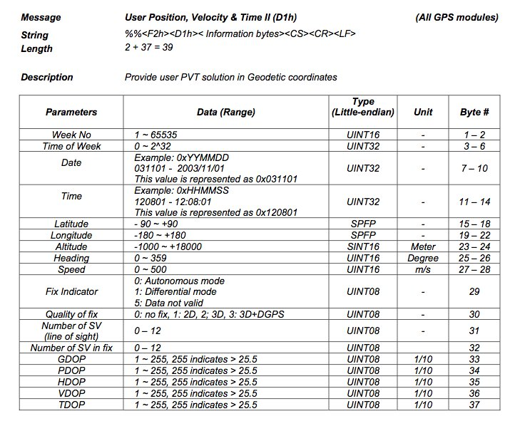
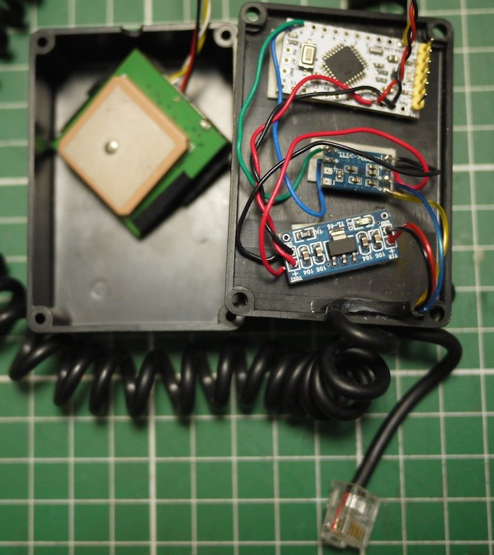

# SynScanGPS

Emulate a SynScan GPS using an Arduino and a cheap GPS

# Hardware
- Arduino Mini
- 12VDC -> 5VDC converter
- RS232/TTL adapter
- RJ cable to the SynScan extension port (12v & RS232)

 

Thanks to keymlinux for the latitude/longitude encoding
